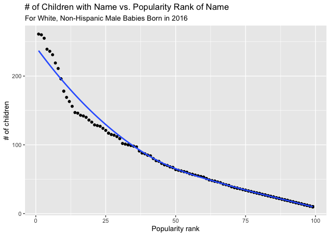

P8105: Homework \#2
================
Zachary Katz (UNI: zak2132)
10/8/2021

## Problem 1

First, we want to read in the data set, making sure to do the following:

-   Specify the sheet in the Excel file and omit non-data entries using
    arguments in `read_excel`
-   Omit rows that do not include dumpster-specific data
-   Round the number of sports balls to the nearest integer

``` r
# Read in the Mr. Trash Wheel excel file
trash_data = read_excel(
      "Data/Trash-Wheel-Collection-Totals-8-6-19.xlsx",
      sheet = "Mr. Trash Wheel",
      range = "A2:N408"
) %>% 
   # Clean names
   janitor::clean_names() %>%
   # Omit rows that do not include dumpster-specific data and round sports balls to nearest integer
   drop_na("dumpster") %>% 
   mutate(sports_balls = round(sports_balls, 0))
```

Next, we want to read and clean precipitation data for 2018 and 2019,
with the following instructions:

-   Omit rows without precipitation data
-   Add a variable for year
-   Combine precipitation datasets and convert month to a character
    variable

``` r
# Read in 2019 precipitation data
precipitation_data_2019 = read_excel(
      "Data/Trash-Wheel-Collection-Totals-8-6-19.xlsx",
      sheet = "2019 Precipitation",
      skip = 1
) %>% 
   # Clean names and drop missing
   janitor::clean_names() %>% 
      drop_na("total") %>% 
      # Also want to eliminate annual total
      drop_na("month") %>% 
      # Add year column
      mutate(year = 2019)
```

Now let’s repeat what we did for the 2019 precipitation data, but this
time for 2018, then join it to 2019 precipitation data.

``` r
# Read in 2018 precipitation data and clean names
precipitation_data_2018 = read_excel(
      "Data/Trash-Wheel-Collection-Totals-8-6-19.xlsx",
      sheet = "2018 Precipitation",
      skip = 1
) %>% 
      janitor::clean_names() %>% 
      drop_na("total") %>% 
      # Also want to eliminate annual total
      drop_na("month") %>%
      # Add year column
      mutate(year = 2018)

# Combine precipitation datasets and convert month to a character variable
precipitation_data_18and19 = bind_rows(
      precipitation_data_2018, precipitation_data_2019
) %>% 
      mutate(month = month.name[month]) %>% 
      # Will also move year column forward a bit
      relocate(year, .after = month)
```

Now that we have our two resulting data sets imported and cleaned, let’s
explore them.

### `trash_data` from Mr. Trash Wheel dataset

First, let’s take a quick look at the head, tail, structure, summary,
and skim of the `trash_data` data frame, just for fun.

``` r
# Head of trash data frame
head(trash_data)
```

    ## # A tibble: 6 × 14
    ##   dumpster month  year date                weight_tons volume_cubic_yards
    ##      <dbl> <chr> <dbl> <dttm>                    <dbl>              <dbl>
    ## 1        1 May    2014 2014-05-16 00:00:00        4.31                 18
    ## 2        2 May    2014 2014-05-16 00:00:00        2.74                 13
    ## 3        3 May    2014 2014-05-16 00:00:00        3.45                 15
    ## 4        4 May    2014 2014-05-17 00:00:00        3.1                  15
    ## 5        5 May    2014 2014-05-17 00:00:00        4.06                 18
    ## 6        6 May    2014 2014-05-20 00:00:00        2.71                 13
    ## # … with 8 more variables: plastic_bottles <dbl>, polystyrene <dbl>,
    ## #   cigarette_butts <dbl>, glass_bottles <dbl>, grocery_bags <dbl>,
    ## #   chip_bags <dbl>, sports_balls <dbl>, homes_powered <dbl>

``` r
# Tail of trash data frame
tail(trash_data)
```

    ## # A tibble: 6 × 14
    ##   dumpster month  year date                weight_tons volume_cubic_yards
    ##      <dbl> <chr> <dbl> <dttm>                    <dbl>              <dbl>
    ## 1      339 May    2019 2019-05-28 00:00:00        2.51                 15
    ## 2      340 May    2019 2019-05-28 00:00:00        2.72                 15
    ## 3      341 May    2019 2019-05-31 00:00:00        3.19                 15
    ## 4      342 June   2019 2019-06-12 00:00:00        3.23                 15
    ## 5      343 June   2019 2019-06-12 00:00:00        3.08                 15
    ## 6      344 June   2019 2019-06-17 00:00:00        3.02                 15
    ## # … with 8 more variables: plastic_bottles <dbl>, polystyrene <dbl>,
    ## #   cigarette_butts <dbl>, glass_bottles <dbl>, grocery_bags <dbl>,
    ## #   chip_bags <dbl>, sports_balls <dbl>, homes_powered <dbl>

``` r
# Structure of trash data frame
str(trash_data)
```

    ## tibble [344 × 14] (S3: tbl_df/tbl/data.frame)
    ##  $ dumpster          : num [1:344] 1 2 3 4 5 6 7 8 9 10 ...
    ##  $ month             : chr [1:344] "May" "May" "May" "May" ...
    ##  $ year              : num [1:344] 2014 2014 2014 2014 2014 ...
    ##  $ date              : POSIXct[1:344], format: "2014-05-16" "2014-05-16" ...
    ##  $ weight_tons       : num [1:344] 4.31 2.74 3.45 3.1 4.06 2.71 1.91 3.7 2.52 3.76 ...
    ##  $ volume_cubic_yards: num [1:344] 18 13 15 15 18 13 8 16 14 18 ...
    ##  $ plastic_bottles   : num [1:344] 1450 1120 2450 2380 980 1430 910 3580 2400 1340 ...
    ##  $ polystyrene       : num [1:344] 1820 1030 3100 2730 870 2140 1090 4310 2790 1730 ...
    ##  $ cigarette_butts   : num [1:344] 126000 91000 105000 100000 120000 90000 56000 112000 98000 130000 ...
    ##  $ glass_bottles     : num [1:344] 72 42 50 52 72 46 32 58 49 75 ...
    ##  $ grocery_bags      : num [1:344] 584 496 1080 896 368 ...
    ##  $ chip_bags         : num [1:344] 1162 874 2032 1971 753 ...
    ##  $ sports_balls      : num [1:344] 7 5 6 6 7 5 3 6 6 7 ...
    ##  $ homes_powered     : num [1:344] 0 0 0 0 0 0 0 0 0 0 ...

``` r
# Summary of trash data frame
summary(trash_data)
```

    ##     dumpster         month                year     
    ##  Min.   :  1.00   Length:344         Min.   :2014  
    ##  1st Qu.: 86.75   Class :character   1st Qu.:2015  
    ##  Median :172.50   Mode  :character   Median :2017  
    ##  Mean   :172.50                      Mean   :2016  
    ##  3rd Qu.:258.25                      3rd Qu.:2018  
    ##  Max.   :344.00                      Max.   :2019  
    ##       date                      weight_tons    volume_cubic_yards
    ##  Min.   :2014-05-16 00:00:00   Min.   :0.960   Min.   : 7.00     
    ##  1st Qu.:2015-07-05 00:00:00   1st Qu.:2.757   1st Qu.:15.00     
    ##  Median :2017-03-31 00:00:00   Median :3.265   Median :15.00     
    ##  Mean   :2016-12-23 10:57:12   Mean   :3.263   Mean   :15.54     
    ##  3rd Qu.:2018-05-19 18:00:00   3rd Qu.:3.772   3rd Qu.:16.00     
    ##  Max.   :2019-06-17 00:00:00   Max.   :5.620   Max.   :20.00     
    ##  plastic_bottles   polystyrene   cigarette_butts  glass_bottles   
    ##  Min.   : 210.0   Min.   : 320   Min.   :   980   Min.   :  0.00  
    ##  1st Qu.: 957.5   1st Qu.:1065   1st Qu.:  7000   1st Qu.: 10.00  
    ##  Median :1835.0   Median :2075   Median : 19000   Median : 21.50  
    ##  Mean   :1873.2   Mean   :2139   Mean   : 30754   Mean   : 25.36  
    ##  3rd Qu.:2552.5   3rd Qu.:3120   3rd Qu.: 38000   3rd Qu.: 38.00  
    ##  Max.   :5960.0   Max.   :6540   Max.   :310000   Max.   :110.00  
    ##   grocery_bags    chip_bags       sports_balls   homes_powered  
    ##  Min.   :  50   Min.   : 230.0   Min.   : 0.00   Min.   : 0.00  
    ##  1st Qu.: 600   1st Qu.: 977.5   1st Qu.: 5.00   1st Qu.:35.62  
    ##  Median :1050   Median :1630.0   Median : 8.00   Median :51.42  
    ##  Mean   :1311   Mean   :1780.3   Mean   :11.81   Mean   :43.83  
    ##  3rd Qu.:1912   3rd Qu.:2490.0   3rd Qu.:16.00   3rd Qu.:59.50  
    ##  Max.   :3750   Max.   :5085.0   Max.   :56.00   Max.   :93.67

``` r
# Skim of trash data frame
skimr::skim(trash_data)
```

|                                                  |             |
|:-------------------------------------------------|:------------|
| Name                                             | trash\_data |
| Number of rows                                   | 344         |
| Number of columns                                | 14          |
| \_\_\_\_\_\_\_\_\_\_\_\_\_\_\_\_\_\_\_\_\_\_\_   |             |
| Column type frequency:                           |             |
| character                                        | 1           |
| numeric                                          | 12          |
| POSIXct                                          | 1           |
| \_\_\_\_\_\_\_\_\_\_\_\_\_\_\_\_\_\_\_\_\_\_\_\_ |             |
| Group variables                                  | None        |

Data summary

**Variable type: character**

| skim\_variable | n\_missing | complete\_rate | min | max | empty | n\_unique | whitespace |
|:---------------|-----------:|---------------:|----:|----:|------:|----------:|-----------:|
| month          |          0 |              1 |   3 |   9 |     0 |        12 |          0 |

**Variable type: numeric**

| skim\_variable       | n\_missing | complete\_rate |     mean |       sd |      p0 |     p25 |      p50 |      p75 |      p100 | hist  |
|:---------------------|-----------:|---------------:|---------:|---------:|--------:|--------:|---------:|---------:|----------:|:------|
| dumpster             |          0 |              1 |   172.50 |    99.45 |    1.00 |   86.75 |   172.50 |   258.25 |    344.00 | ▇▇▇▇▇ |
| year                 |          0 |              1 |  2016.50 |     1.58 | 2014.00 | 2015.00 |  2017.00 |  2018.00 |   2019.00 | ▇▃▃▆▂ |
| weight\_tons         |          0 |              1 |     3.26 |     0.75 |    0.96 |    2.76 |     3.26 |     3.77 |      5.62 | ▁▅▇▅▁ |
| volume\_cubic\_yards |          0 |              1 |    15.54 |     1.68 |    7.00 |   15.00 |    15.00 |    16.00 |     20.00 | ▁▁▁▇▂ |
| plastic\_bottles     |          0 |              1 |  1873.15 |  1028.87 |  210.00 |  957.50 |  1835.00 |  2552.50 |   5960.00 | ▇▆▅▁▁ |
| polystyrene          |          0 |              1 |  2138.68 |  1202.82 |  320.00 | 1065.00 |  2075.00 |  3120.00 |   6540.00 | ▇▆▅▁▁ |
| cigarette\_butts     |          0 |              1 | 30754.13 | 34492.50 |  980.00 | 7000.00 | 19000.00 | 38000.00 | 310000.00 | ▇▁▁▁▁ |
| glass\_bottles       |          0 |              1 |    25.36 |    18.64 |    0.00 |   10.00 |    21.50 |    38.00 |    110.00 | ▇▅▂▁▁ |
| grocery\_bags        |          0 |              1 |  1311.23 |   881.87 |   50.00 |  600.00 |  1050.00 |  1912.50 |   3750.00 | ▇▇▅▃▁ |
| chip\_bags           |          0 |              1 |  1780.27 |   956.53 |  230.00 |  977.50 |  1630.00 |  2490.00 |   5085.00 | ▇▇▅▂▁ |
| sports\_balls        |          0 |              1 |    11.81 |     9.81 |    0.00 |    5.00 |     8.00 |    16.00 |     56.00 | ▇▃▁▁▁ |
| homes\_powered       |          0 |              1 |    43.83 |    23.98 |    0.00 |   35.62 |    51.42 |    59.50 |     93.67 | ▅▂▇▆▁ |

**Variable type: POSIXct**

| skim\_variable | n\_missing | complete\_rate | min        | max        | median     | n\_unique |
|:---------------|-----------:|---------------:|:-----------|:-----------|:-----------|----------:|
| date           |          0 |              1 | 2014-05-16 | 2019-06-17 | 2017-03-31 |       217 |

The trash data frame, which we call `trash_data`, has 344 observations
and 14 variables. These variables are: dumpster, month, year, date,
weight\_tons, volume\_cubic\_yards, plastic\_bottles, polystyrene,
cigarette\_butts, glass\_bottles, grocery\_bags, chip\_bags,
sports\_balls, homes\_powered.

We are asked to calculate the median number of sports balls in a
dumpster in 2017, which is 8.

### `precipitation_data_18and19` from Mr. Trash Wheel dataset

Now, let’s also take a look at the precipitation data from 2018 and 2019
that we merged into the `precipitation_data_18and19` data frame.

``` r
# Head of precipitation data frame
head(precipitation_data_18and19)
```

    ## # A tibble: 6 × 3
    ##   month     year total
    ##   <chr>    <dbl> <dbl>
    ## 1 January   2018  0.94
    ## 2 February  2018  4.8 
    ## 3 March     2018  2.69
    ## 4 April     2018  4.69
    ## 5 May       2018  9.27
    ## 6 June      2018  4.77

``` r
# Tail of precipitation data frame
tail(precipitation_data_18and19)
```

    ## # A tibble: 6 × 3
    ##   month     year total
    ##   <chr>    <dbl> <dbl>
    ## 1 January   2019  3.1 
    ## 2 February  2019  3.64
    ## 3 March     2019  4.47
    ## 4 April     2019  1.46
    ## 5 May       2019  3.58
    ## 6 June      2019  0.42

``` r
# Structure of precipitation data frame
str(precipitation_data_18and19)
```

    ## tibble [18 × 3] (S3: tbl_df/tbl/data.frame)
    ##  $ month: chr [1:18] "January" "February" "March" "April" ...
    ##  $ year : num [1:18] 2018 2018 2018 2018 2018 ...
    ##  $ total: num [1:18] 0.94 4.8 2.69 4.69 9.27 ...

``` r
# Summary of precipitation data frame
summary(precipitation_data_18and19)
```

    ##     month                year          total       
    ##  Length:18          Min.   :2018   Min.   : 0.420  
    ##  Class :character   1st Qu.:2018   1st Qu.: 2.792  
    ##  Mode  :character   Median :2018   Median : 4.580  
    ##                     Mean   :2018   Mean   : 4.833  
    ##                     3rd Qu.:2019   3rd Qu.: 6.365  
    ##                     Max.   :2019   Max.   :10.470

``` r
# Skim of precipitation data frame
skimr::skim(precipitation_data_18and19)
```

|                                                  |                              |
|:-------------------------------------------------|:-----------------------------|
| Name                                             | precipitation\_data\_18and1… |
| Number of rows                                   | 18                           |
| Number of columns                                | 3                            |
| \_\_\_\_\_\_\_\_\_\_\_\_\_\_\_\_\_\_\_\_\_\_\_   |                              |
| Column type frequency:                           |                              |
| character                                        | 1                            |
| numeric                                          | 2                            |
| \_\_\_\_\_\_\_\_\_\_\_\_\_\_\_\_\_\_\_\_\_\_\_\_ |                              |
| Group variables                                  | None                         |

Data summary

**Variable type: character**

| skim\_variable | n\_missing | complete\_rate | min | max | empty | n\_unique | whitespace |
|:---------------|-----------:|---------------:|----:|----:|------:|----------:|-----------:|
| month          |          0 |              1 |   3 |   9 |     0 |        12 |          0 |

**Variable type: numeric**

| skim\_variable | n\_missing | complete\_rate |    mean |   sd |      p0 |     p25 |     p50 |     p75 |    p100 | hist  |
|:---------------|-----------:|---------------:|--------:|-----:|--------:|--------:|--------:|--------:|--------:|:------|
| year           |          0 |              1 | 2018.33 | 0.49 | 2018.00 | 2018.00 | 2018.00 | 2019.00 | 2019.00 | ▇▁▁▁▃ |
| total          |          0 |              1 |    4.83 | 3.04 |    0.42 |    2.79 |    4.58 |    6.36 |   10.47 | ▅▅▇▁▃ |

The precipitation data frame, which we call
`precipitation_data_18and19`, has 18 observations and 3 variables. These
variables are: month, year, total.

We are asked to calculate the total precipitation in 2018, which is
equal to 70.33 inches.

## Problem 2

We’re going to use FiveThirtyEight data for the next exercise. First, we
should import and clean it up. Let’s do the `pols-month.csv` data first,
which contains observations regarding the political affiliations of
national politicians over time.

``` r
# Import `pols-month.csv` file
pols_month_df = read_csv("Data/pols-month.csv")
```

    ## Rows: 822 Columns: 9

    ## ── Column specification ────────────────────────────────────────────────────────
    ## Delimiter: ","
    ## dbl  (8): prez_gop, gov_gop, sen_gop, rep_gop, prez_dem, gov_dem, sen_dem, r...
    ## date (1): mon

    ## 
    ## ℹ Use `spec()` to retrieve the full column specification for this data.
    ## ℹ Specify the column types or set `show_col_types = FALSE` to quiet this message.

``` r
# Clean the data in various ways
pols_month_df = pols_month_df %>%
   janitor::clean_names() %>% 
   # Break up variable into integer variables
   separate(col = mon, into = c("year", "month", "day"), sep = "-") %>% 
   mutate(year = as.numeric(year), 
          month = as.numeric(month), 
          day = as.numeric(day)) %>% 
   # Replace month number with month name
   mutate(month = month.name[month]) %>% 
   # Create `president` variable with values from `prez_dem` and 'prez_gop` then remove extraneous vars
   pivot_longer(
      cols = c("prez_dem", "prez_gop"),
      names_to = "presidential_party",
      values_to = "has_president") %>% 
   filter(has_president == 1) %>% 
   select(-has_president) %>% 
   mutate(presidential_party = recode(presidential_party, "prez_dem" = "dem", "prez_gop" = "gop")) %>% 
   # Remove the `day` variable
   select(-day)

# Check out the head of the data frame
head(pols_month_df)
```

    ## # A tibble: 6 × 9
    ##    year month    gov_gop sen_gop rep_gop gov_dem sen_dem rep_dem presidential_pa…
    ##   <dbl> <chr>      <dbl>   <dbl>   <dbl>   <dbl>   <dbl>   <dbl> <chr>           
    ## 1  1947 January       23      51     253      23      45     198 dem             
    ## 2  1947 February      23      51     253      23      45     198 dem             
    ## 3  1947 March         23      51     253      23      45     198 dem             
    ## 4  1947 April         23      51     253      23      45     198 dem             
    ## 5  1947 May           23      51     253      23      45     198 dem             
    ## 6  1947 June          23      51     253      23      45     198 dem

Now that we’ve cleaned up the `pols_month` data, let’s read in and clean
up the `snp` data, too! These are observations of variables related to
the S&P market index.

``` r
# Import using `read_csv` and start cleaning
snp_df = read_csv("Data/snp.csv") %>% 
   janitor::clean_names() %>% 
   # Break up and clean date variable
   separate(col = date, into = c("month", "day", "year"), sep = "/") %>% 
   mutate(year = as.numeric(year), 
          month = as.numeric(month), 
          day = as.numeric(day)) %>% 
   # Replace month number with month name and remove `day` variable
   mutate(month = month.name[month]) %>% 
   select(-day)
```

    ## Rows: 787 Columns: 2

    ## ── Column specification ────────────────────────────────────────────────────────
    ## Delimiter: ","
    ## chr (1): date
    ## dbl (1): close

    ## 
    ## ℹ Use `spec()` to retrieve the full column specification for this data.
    ## ℹ Specify the column types or set `show_col_types = FALSE` to quiet this message.

``` r
# Check out the head of the data frame
head(snp_df)
```

    ## # A tibble: 6 × 3
    ##   month     year close
    ##   <chr>    <dbl> <dbl>
    ## 1 July        15 2080.
    ## 2 June        15 2063.
    ## 3 May         15 2107.
    ## 4 April       15 2086.
    ## 5 March       15 2068.
    ## 6 February    15 2104.

Finally, let’s import and tidy the unemployment data so that it can be
merged with the other two datasets. For instance, we need to make sure
the keys have the same names and take the same values.

``` r
# Import `unemployment` dataset and start to clean, using read_csv
unemployment_df = read_csv("Data/unemployment.csv") %>% 
   janitor::clean_names() %>% 
   # Pivot longer to get tidy data
   pivot_longer(
      cols = jan:dec,
      names_to = "month",
      values_to = "percent_unemployed"
   ) %>% 
   # Recode month names
   mutate(month = recode(month, 
                         "jan" = "January",
                         "feb" = "February",
                         "mar" = "March",
                         "apr" = "April",
                         "may" = "May",
                         "jun" = "June",
                         "jul" = "July",
                         "aug" = "August",
                         "sep" = "September",
                         "oct" = "October",
                         "nov" = "November",
                         "dec" = "December")) %>%
   # Make sure table is a data frame structure
   data.frame()
```

    ## Rows: 68 Columns: 13

    ## ── Column specification ────────────────────────────────────────────────────────
    ## Delimiter: ","
    ## dbl (13): Year, Jan, Feb, Mar, Apr, May, Jun, Jul, Aug, Sep, Oct, Nov, Dec

    ## 
    ## ℹ Use `spec()` to retrieve the full column specification for this data.
    ## ℹ Specify the column types or set `show_col_types = FALSE` to quiet this message.

``` r
# Check out the head of the data frame
head(unemployment_df)
```

    ##   year    month percent_unemployed
    ## 1 1948  January                3.4
    ## 2 1948 February                3.8
    ## 3 1948    March                4.0
    ## 4 1948    April                3.9
    ## 5 1948      May                3.5
    ## 6 1948     June                3.6

Now that we have three tidy datasets, we want to merge them using `year`
and `month` as keys.

Begin by merging `snp` into `pols`, and then proceed by merging
`unemployment` into the result. We should use a **left join** to make
sure we keep all entries in `pols_month_df` and only joining
observations from the S&P that also occur in the months recorded for
`pols_month_df`.

Once we have our intermediate df, which we call `pols_and_snp_df`, we
then do another left join with `unemployment_df`, keeping only those
unemployment observations that have corresponding `month` and `year` in
`pols_and_snp_df`, but all observations from the latter regardless of
whether matching unemployment data is available.

``` r
# Keep all observations in `pols_month_df`, but only include observations from `pols_df` that match on the `month` and `year` keys
pols_and_snp_df = 
   left_join(pols_month_df, snp_df, by = c("year", "month"))

# Keep all observations in intermediate dataframe `pols_and_snp_df`, and left join with `unemployment_df` on the same keys
# Note that we need to convert `unemployment_df` to a data frame in this step
final_df =
   left_join(pols_and_snp_df, unemployment_df, by = c("year", "month")) %>% 
   # Rename `close` column to be more descriptive
   rename("snp_close" = "close")

# Check out head of final df post-join
final_df
```

    ## # A tibble: 817 × 11
    ##     year month     gov_gop sen_gop rep_gop gov_dem sen_dem rep_dem presidential_pa…
    ##    <dbl> <chr>       <dbl>   <dbl>   <dbl>   <dbl>   <dbl>   <dbl> <chr>           
    ##  1  1947 January        23      51     253      23      45     198 dem             
    ##  2  1947 February       23      51     253      23      45     198 dem             
    ##  3  1947 March          23      51     253      23      45     198 dem             
    ##  4  1947 April          23      51     253      23      45     198 dem             
    ##  5  1947 May            23      51     253      23      45     198 dem             
    ##  6  1947 June           23      51     253      23      45     198 dem             
    ##  7  1947 July           23      51     253      23      45     198 dem             
    ##  8  1947 August         23      51     253      23      45     198 dem             
    ##  9  1947 September      23      51     253      23      45     198 dem             
    ## 10  1947 October        23      51     253      23      45     198 dem             
    ## # … with 807 more rows, and 2 more variables: snp_close <dbl>,
    ## #   percent_unemployed <dbl>

Finally, let’s describe each of the three original data frames, and then
the merged data frame.

The `pols_month_df` data frame contains 817 observations of 9 variables
related to the number of Democrat or Republican (GOP) national
politicians ranging from the years 1947 to 2015. Variables include year,
month, gov\_gop, sen\_gop, rep\_gop, gov\_dem, sen\_dem, rep\_dem,
presidential\_party, which generally convey information about the number
of governors, senators, and representatives from each party in any given
month, as well as the president’s party.

The `snp_df` data frame contains 787 observations of 3 variables related
to the S&P stock market index ranging from the years 0 to 99. Variables
include month, year, close, which generally convey information about the
closing values of the S&P stock index on an early day (typically 1st,
2nd, or 3rd) of any given month.

The `unemployment_df` data frame contains 816 observations of 3
variables related to the unemployment rate by month ranging from the
years 1948 to 2015. Variables include year, month, percent\_unemployed,
with `percent_unemployed` conveying the percent unemployed in each
month.

Finally, we merged these dataframes into a unified dataframe called
`final_df` using left joins from the original `pols_month_df` dataframe,
meaning that the final table took only those `snp_df` and
`unemployment_df` observations that matched on the `month` and `year`
keys to the `pols_month_df`. In other words, the `final_df` could have
no more observations than the `pols_month_df`, which we find to be true:
it has 817 observations of 11 variables, which makes sense because we
simply added one non-key column from each of the other two data frames
(`snp_close` and `percent_unemployed`). Of course, the monthly data in
this final data frame ranges over the same years, from 1947 to 2015.

## Problem 3

This problem requires us to use data from NYC Open data regarding baby
name popularity – so let’s import that to start.

``` r
# Import NYC Open data set for baby name popularity
baby_names_df = read_csv("Data/Popular_Baby_Names.csv") %>% 
   janitor::clean_names()
```

    ## Rows: 19418 Columns: 6

    ## ── Column specification ────────────────────────────────────────────────────────
    ## Delimiter: ","
    ## chr (3): Gender, Ethnicity, Child's First Name
    ## dbl (3): Year of Birth, Count, Rank

    ## 
    ## ℹ Use `spec()` to retrieve the full column specification for this data.
    ## ℹ Specify the column types or set `show_col_types = FALSE` to quiet this message.

Before we tidy the data, let’s examine its basic structure.

``` r
# Head of baby_names_df
head(baby_names_df)
```

    ## # A tibble: 6 × 6
    ##   year_of_birth gender ethnicity                  childs_first_name count  rank
    ##           <dbl> <chr>  <chr>                      <chr>             <dbl> <dbl>
    ## 1          2016 FEMALE ASIAN AND PACIFIC ISLANDER Olivia              172     1
    ## 2          2016 FEMALE ASIAN AND PACIFIC ISLANDER Chloe               112     2
    ## 3          2016 FEMALE ASIAN AND PACIFIC ISLANDER Sophia              104     3
    ## 4          2016 FEMALE ASIAN AND PACIFIC ISLANDER Emily                99     4
    ## 5          2016 FEMALE ASIAN AND PACIFIC ISLANDER Emma                 99     4
    ## 6          2016 FEMALE ASIAN AND PACIFIC ISLANDER Mia                  79     5

``` r
# Tail of baby_names_df
tail(baby_names_df)
```

    ## # A tibble: 6 × 6
    ##   year_of_birth gender ethnicity          childs_first_name count  rank
    ##           <dbl> <chr>  <chr>              <chr>             <dbl> <dbl>
    ## 1          2011 MALE   WHITE NON HISPANIC BERISH               10    97
    ## 2          2011 MALE   WHITE NON HISPANIC STEPHEN              10    97
    ## 3          2011 MALE   WHITE NON HISPANIC STEPHEN              10    97
    ## 4          2011 MALE   WHITE NON HISPANIC DEREK                10    97
    ## 5          2011 MALE   WHITE NON HISPANIC BENNETT              10    97
    ## 6          2011 MALE   WHITE NON HISPANIC ELLIS                10    97

``` r
# Structure of baby_names_df
str(baby_names_df)
```

    ## spec_tbl_df [19,418 × 6] (S3: spec_tbl_df/tbl_df/tbl/data.frame)
    ##  $ year_of_birth    : num [1:19418] 2016 2016 2016 2016 2016 ...
    ##  $ gender           : chr [1:19418] "FEMALE" "FEMALE" "FEMALE" "FEMALE" ...
    ##  $ ethnicity        : chr [1:19418] "ASIAN AND PACIFIC ISLANDER" "ASIAN AND PACIFIC ISLANDER" "ASIAN AND PACIFIC ISLANDER" "ASIAN AND PACIFIC ISLANDER" ...
    ##  $ childs_first_name: chr [1:19418] "Olivia" "Chloe" "Sophia" "Emily" ...
    ##  $ count            : num [1:19418] 172 112 104 99 99 79 59 57 56 56 ...
    ##  $ rank             : num [1:19418] 1 2 3 4 4 5 6 7 8 8 ...
    ##  - attr(*, "spec")=
    ##   .. cols(
    ##   ..   `Year of Birth` = col_double(),
    ##   ..   Gender = col_character(),
    ##   ..   Ethnicity = col_character(),
    ##   ..   `Child's First Name` = col_character(),
    ##   ..   Count = col_double(),
    ##   ..   Rank = col_double()
    ##   .. )
    ##  - attr(*, "problems")=<externalptr>

``` r
# Summary of baby_names_df
summary(baby_names_df)
```

    ##  year_of_birth     gender           ethnicity         childs_first_name 
    ##  Min.   :2011   Length:19418       Length:19418       Length:19418      
    ##  1st Qu.:2012   Class :character   Class :character   Class :character  
    ##  Median :2013   Mode  :character   Mode  :character   Mode  :character  
    ##  Mean   :2013                                                           
    ##  3rd Qu.:2014                                                           
    ##  Max.   :2016                                                           
    ##      count             rank      
    ##  Min.   : 10.00   Min.   :  1.0  
    ##  1st Qu.: 13.00   1st Qu.: 38.0  
    ##  Median : 20.00   Median : 59.0  
    ##  Mean   : 33.52   Mean   : 57.5  
    ##  3rd Qu.: 36.00   3rd Qu.: 78.0  
    ##  Max.   :426.00   Max.   :102.0

Even before tidying the data, let’s deal with the issue that immediately
sticks out, which are the all uppercase entries in `gender`,
`ethnicity`, and `childs_first_name`, as well as a couple of unnecessary
long column names.

``` r
# Fix naming conventions
baby_names_df = baby_names_df %>% 
   # Convert all uppercase entries to title case
   mutate(gender = str_to_title(gender),
          ethnicity = str_to_title(ethnicity),
          childs_first_name = str_to_title(childs_first_name)) %>% 
   # Simplify column names
   rename("birth_year" = "year_of_birth",
          "name" = "childs_first_name")

# Check out head of data frame
head(baby_names_df)
```

    ## # A tibble: 6 × 6
    ##   birth_year gender ethnicity                  name   count  rank
    ##        <dbl> <chr>  <chr>                      <chr>  <dbl> <dbl>
    ## 1       2016 Female Asian And Pacific Islander Olivia   172     1
    ## 2       2016 Female Asian And Pacific Islander Chloe    112     2
    ## 3       2016 Female Asian And Pacific Islander Sophia   104     3
    ## 4       2016 Female Asian And Pacific Islander Emily     99     4
    ## 5       2016 Female Asian And Pacific Islander Emma      99     4
    ## 6       2016 Female Asian And Pacific Islander Mia       79     5

idy data has one observation per row, one variable per column, and one
value per cell. The 6 columns in this data frame are birth\_year,
gender, ethnicity, name, count, rank, and at first glance, these are all
variables. Each of the 19418 rows in the data frame also seems to
represent a single observation, and each cell contains a value that
corresponds to the proper observation and variable. Great!

One thing we could do is recode gender and ethnicity as factor
variables, which may make our analysis easier. We also want to
deduplicate rows.

``` r
# Continue cleaning data frame
baby_names_df = baby_names_df %>%
   # Recode `gender` and `ethnicity` as factor variables
   mutate(gender = as.factor(gender),
          ethnicity = as.factor(ethnicity)) %>% 
   # Deduplicate rows
   distinct()

# What are the categories/factors for gender?
levels(pull(baby_names_df, gender))
```

    ## [1] "Female" "Male"

``` r
# What are the categories/factors for ethnicity?
levels(pull(baby_names_df, ethnicity))
```

    ## [1] "Asian And Paci"             "Asian And Pacific Islander"
    ## [3] "Black Non Hisp"             "Black Non Hispanic"        
    ## [5] "Hispanic"                   "White Non Hisp"            
    ## [7] "White Non Hispanic"

Now that we’ve deduplicated rows, there are now only 12181 observations,
which is far fewer than before. However, we need to fix the factors for
ethnicity.

``` r
# Recode factors in `ethnicity`
baby_names_df = baby_names_df %>% 
   mutate(ethnicity = recode(ethnicity,
                             "Asian And Paci" = "Asian And Pacific Islander",
                             "Black Non Hisp" = "Black Non Hispanic",
                             "White Non Hisp" = "White Non Hispanic"))

# Confirm the levels look better
levels(pull(baby_names_df, ethnicity))
```

    ## [1] "Asian And Pacific Islander" "Black Non Hispanic"        
    ## [3] "Hispanic"                   "White Non Hispanic"

We are then asked to create a well-structured, reader-friendly table
showing the rank in popularity of the name “Olivia” as a female baby
name over time, with rows for ethnicities and columns for year. We do so
in the following way:

``` r
# Track popularity rank of "Olivia" for female babies over time
olivia_popularity = baby_names_df %>% 
   # No need for count value
   select(-count) %>% 
   # Filter for females named Olivia only
   filter (gender == "Female", name == "Olivia") %>% 
   select(-gender, -name) %>% 
   # Pivot to get rows for ethnicities and columns for years
   pivot_wider(names_from = "birth_year",
               values_from = "rank") %>% 
   # Sort year columns in ascending order
   relocate("ethnicity", "2011":"2016") %>% 
   # Put in reader-friendly tabular format
   knitr::kable()

# View table of Olivias
olivia_popularity
```

| ethnicity                  | 2011 | 2012 | 2013 | 2014 | 2015 | 2016 |
|:---------------------------|-----:|-----:|-----:|-----:|-----:|-----:|
| Asian And Pacific Islander |    4 |    3 |    3 |    1 |    1 |    1 |
| Black Non Hispanic         |   10 |    8 |    6 |    8 |    4 |    8 |
| Hispanic                   |   18 |   22 |   22 |   16 |   16 |   13 |
| White Non Hispanic         |    2 |    4 |    1 |    1 |    1 |    1 |

Now we want to create a similar table showing most popular name among
male children over time. I assume that we want to do so preserving each
ethnic category as its own row again, and each year as a column.

``` r
# Filter popular male names by ethnicity over time
popular_male_names = baby_names_df %>% 
   # Select only male names ranked #1 for each ethnicity
   filter(gender == "Male", rank == 1) %>%
   # Remove unnecessary variables
   select(-gender, -rank, -count) %>% 
   # Pivot the table as appropriate
   pivot_wider(names_from = "birth_year",
               values_from = "name") %>% 
   # Re-arrange years to be in ascending order
   relocate("ethnicity", "2011":"2016") %>% 
   # Put table in reader-friendly format
   knitr::kable()

# View table of popular male names
popular_male_names
```

| ethnicity                  | 2011    | 2012   | 2013   | 2014   | 2015   | 2016   |
|:---------------------------|:--------|:-------|:-------|:-------|:-------|:-------|
| Asian And Pacific Islander | Ethan   | Ryan   | Jayden | Jayden | Jayden | Ethan  |
| Black Non Hispanic         | Jayden  | Jayden | Ethan  | Ethan  | Noah   | Noah   |
| Hispanic                   | Jayden  | Jayden | Jayden | Liam   | Liam   | Liam   |
| White Non Hispanic         | Michael | Joseph | David  | Joseph | David  | Joseph |

Finally, for male, white non-hispanic children born in 2016, we want to
produce a scatter plot showing the number of children with a name
(y-axis) against the rank in popularity of that name (x-axis).

``` r
# Create the data frame for the scatter plot with appropriate filters and scoped set of variables
scatterplot_df = baby_names_df %>% 
   # Filter for appropriate variables (birth year, gender, ethnicity)
   filter(birth_year == 2016, gender == "Male", ethnicity == "White Non Hispanic") %>% 
   # Keep name just to have it on record, easier to read the table this way
   select(name, count, rank)

# Produce scatter plot with x-axis popularity rank and y-axis count
# First instantiate the scatter plot
ggplot(
   data = scatterplot_df,
   aes(
      x = rank,
      y = count
   )
) + 
   # Then fill the scatter plot
   geom_point() + 
   # Add appropriate labels
   labs(
      title = "# of Children with Name vs. Popularity Rank of Name",
      subtitle = "For White, Non-Hispanic Male Babies Born in 2016",
      x = "Popularity rank",
      y = "# of children"
   ) + 
   # We can even add a trend line
   geom_smooth(se = FALSE)
```

    ## `geom_smooth()` using method = 'loess' and formula 'y ~ x'

<!-- -->

How interesting! There seems to be an inverse exponential relationship:
as we go in descending order from popularity rank 1 down to 100, the \#
of children born with that name seems to exponentially decline.
